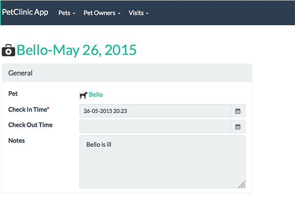

= Step 9: Add actions and disable edit

==== *the basics* in 10 minutes

'''
*Checkout the code with the results of this exercise on:*

* link:https://github.com/johandoornenbal/petclinic_mynewcode/tree/tutorial06[]

'''

You may have wondered already whether it is advisable for `checkInTime` and `checkOutTime` to be editable.
That is probably not what you intend.
Some consider it good practice to disable the editing of Objects by default and consciously add actions.
That is what we are going to demonstrate in this step.

We start out with modifying `isis.properties` to disable editing on a global level:
----
isis.objects.editing=false
----

The result is that an instance of `Visit` is no longer editable.

The next task is to create actions:

* since Pets may change from owner we add `changeOwner()`
* on `Visit` we create an `addNote()` action to add additional notes
* on `Visit` we create an `checkout()` action adding a final note

Take note of the validation method - Apache Isis recognizes this method using the following convention:

* The name of the method is `validateXxx` where `xxx` is the method to be evaluated
* `validateXxx` returns a `String` when validation fails and `null` when it succeeds
* the params in `validateXxx` are equal to those in `xxx`

----
public Pet changeOwner(final @ParameterLayout(named = "New Pet Owner") PetOwner newPetOwner) {
    setPetOwner(newPetOwner);
    return this;
}

public String validateChangeOwner(final PetOwner newPetOwner) {
    return newPetOwner == getPetOwner() ? "Already the owner" : null;
}
----

On `Visit`:
----
public Visit checkout(final @ParameterLayout(named = "Checkout note") String note) {
    addNote(note);
    setCheckOutTime(clockService.nowAsDateTime());
    return this;
}
----

and:

----
public Visit addNote(final @ParameterLayout(named = "Note") String note) {
    final String currentNote = getNotes() == null ? "" : getNotes().concat("\n");
    setNotes(currentNote.concat(String.format("%s: %s", LocalDateTime.now().toString("yyyy-MM-dd HH:MM"), note)));
    return this;
}
----

Observe the change in `Visits`:
----
obj.addNote(notes);
----

'''
link:9_petclinic_addvisit.adoc[<< BACK] | link:11_petclinic_addcontributions.adoc[NEXT >>]