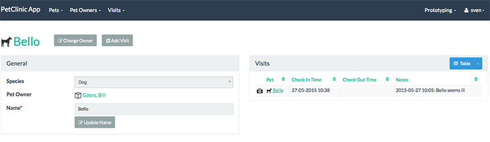
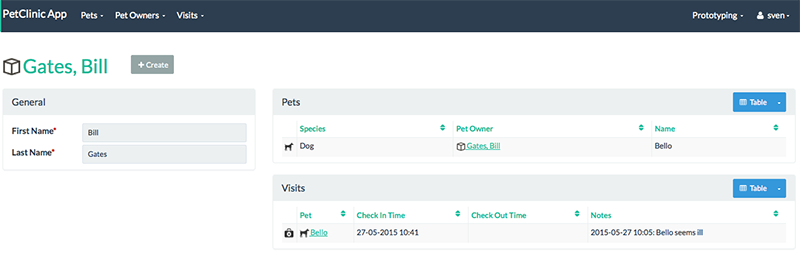

= Step 10: Add contributions

==== *the basics* in 10 minutes

'''
*Checkout the code with the results of this exercise on:*

* link:https://github.com/johandoornenbal/petclinic_mynewcode/tree/tutorial07[]

'''

When we consider the relation between a `Visit` and a `Pet` you can describe it as

* a `Visit` knows about a `Pet`
* a `Pet` is ignorant of `Visit` 's

Because a `Visit` knows it's `Pet` it is possible - using the Apache Isis framework - to display the `Visit` 's a `Pet` has
paid to the clinic. We call this a 'contribution'. In this case a 'contributed collection'.

----
@DomainService(nature = NatureOfService.VIEW_CONTRIBUTIONS_ONLY)
public class VisitContributions {

    @Action(semantics = SemanticsOf.SAFE)
    @ActionLayout(contributed = Contributed.AS_ASSOCIATION)
    @CollectionLayout(render = RenderType.EAGERLY)
    public List<Visit> visits(Pet pet){
        return container.allMatches(Visit.class, new Predicate<Visit>() {
            @Override public boolean apply(final Visit input) {
                return input.getPet().equals(pet);
            }
        });
    }

...

    @Inject
    DomainObjectContainer container;
}
----

Note how we use `Predicate` again instead of a query.

Note also the annotation `@ActionLayout(contributed = Contributed.AS_ASSOCIATION)`. This tells the framework to contribute the collection
only and not contribute an action `visits` in the menu or on objects.

Since every `Pet` has exactly one `PetOwner` we can repeat this proces for `PetOwner` also

----
   @Action(semantics = SemanticsOf.SAFE)
    @ActionLayout(contributed = Contributed.AS_ASSOCIATION)
    @CollectionLayout(render = RenderType.EAGERLY)
    public List<Visit> visits(Owner owner){
        return container.allMatches(Visit.class, new Predicate<Visit>() {
            @Override public boolean apply(final Visit input) {
                return input.getPet().getPetOwner().equals(owner);
            }
        });
    }
----

Here are the results

'''
link:10_petclinic_addactions.adoc[<< BACK] | link:12_petclinic_focusonlayout.adoc[NEXT >>]