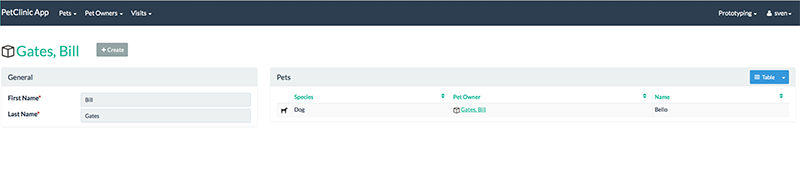
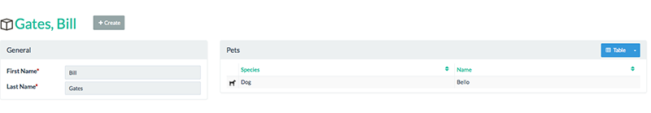
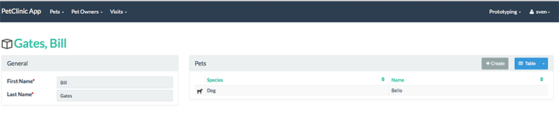
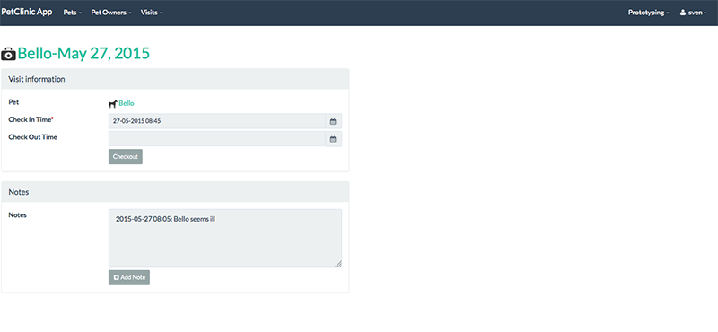
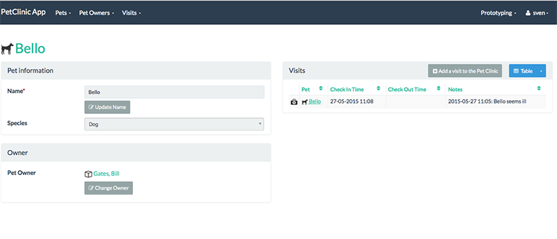

= Step 11: Focus on layout

==== *the basics* in 10 minutes

'''
*Checkout the code with the results of this exercise on:*

* link:https://github.com/johandoornenbal/petclinic_mynewcode/tree/tutorial08[]

'''

In this step we are going to refine the UI.
As mentioned before there are two ways of controlling the UI

* the use of annotations
* overruled by the use of `layout.json` files for more control

When we look at

it is clear that the column `Pet Owner` is superfluous.

We hide it by annotating `getPetOwner` with `@PropertyLayout(hidden = Where.REFERENCES_PARENT)`

----
@MemberOrder(sequence = "3")
@Column(name = "ownerId", allowsNull = "true")
@PropertyLayout(hidden = Where.REFERENCES_PARENT)
public PetOwner getPetOwner() {
    return petOwner;
}
----

Now let's place the CREATE button above the pets collection.
We start out with a `PetOwner.layout.json` file that contains basic json that divides the page in two halves (default)

----
{
    "columns": [
        {
            "span": 6,
            "memberGroups": {}
        },
        {
            "span": 0,
            "memberGroups": {}
        },
        {
            "span": 0,
            "memberGroups": {}
        },
        {
            "span": 6,
            "collections": {}
        }
    ],
    "actions": {}
}
----
We adapt column width and use the following to place the `create` action on the collection "pets"
----
{
    "columns": [
        {
            "span": 4,
            "memberGroups": {}
        },
        {
            "span": 0,
            "memberGroups": {}
        },
        {
            "span": 0,
            "memberGroups": {}
        },
        {
            "span": 8,
            "collections": {
                "pets" : {
                    "actions" : {
                        "create" : {}
                    }
                }
            }
        }
    ],
    "actions": {}
}
----

Now let's work a bit on `Visit`. Again we create a `layout.json` file called `Visit.layout.json` and store it with the object.

----
{
    "columns": [
        {
            "span": 6,
            "memberGroups": {
                "Visit information": {
                    "members": {
                        "pet": {},
                        "checkInTime" : {},
                        "checkOutTime" : {
                            "actions" : {
                                "checkout" : {}
                            }
                        }
                    }
                },
                "Notes" : {
                    "members": {
                        "notes" : {
                            "actions" : {
                                "addNote" : {}
                            }
                        }
                    }
                }
            }
        },
        {
            "span": 0,
            "memberGroups": {}
        },
        {
            "span": 0,
            "memberGroups": {}
        },
        {
            "span": 6,
            "collections": {}
        }
    ],
    "actions": {}
}
----

Now it is your turn. Try something like this with `Pet` and compare your json with ours.

'''
link:11_petclinic_addcontributions.adoc[<< BACK] | link:13_petclinic_createhomepage.adoc[NEXT >>]