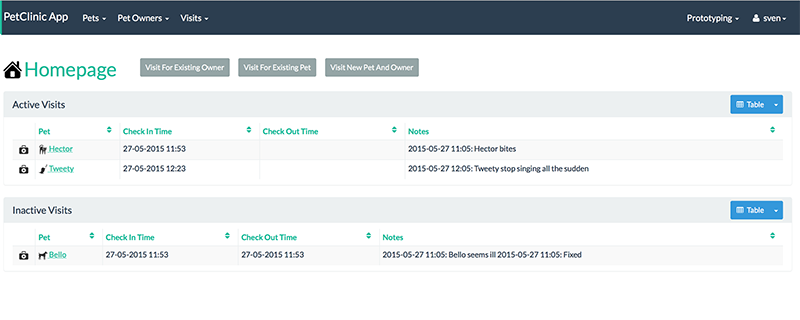

= Step 12: Create a Homepage

==== *the basics* in 10 minutes

'''
*Checkout the code with the results of this exercise on:*

* link:https://github.com/johandoornenbal/petclinic_mynewcode/tree/tutorial09[]

'''

In this step we will modify the homepage in order to make it more functional. As a result we have this as our startup screen
as soon as we are logged in:

Apache Isis recognizes the `@Homepage` annotation on an action when using the Wicket Viewer as we do.
It should be to a single (no-arg) action on a domain service, and the results used as the contents for the home page.
----
public class HomePageService {

    ....

    @HomePage
    public HomePageViewModel homePage() {
        return container.injectServicesInto(new HomePageViewModel());
    }

    ....
}
----

Typically this action would return a `View Model` representing a dashboard from which the user can navigate to commonly used objects and invoked actions.
The viewmodel we use is `HomePageViewModel` and is annotated as such with `@ViewModel`.

----
@ViewModel
public class HomePageViewModel {

    ....

}
----

Check out our code to learn how the methods and collections are created. Note the use of dependency injection.
Here also we use `Predicates` - note the use of link:https://docs.oracle.com/javase/tutorial/java/javaOO/lambdaexpressions.html[Lambda Expressions] -
instead of queries.

'''
link:12_petclinic_focusonlayout.adoc[<< BACK] | link:14_petclinic_addons.adoc[NEXT >>]