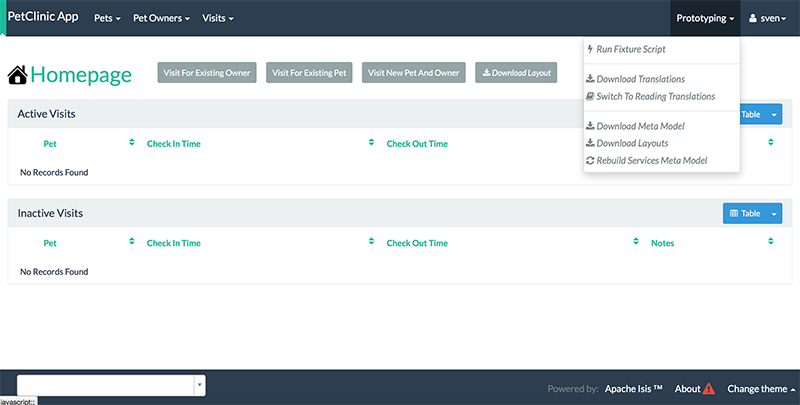
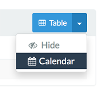
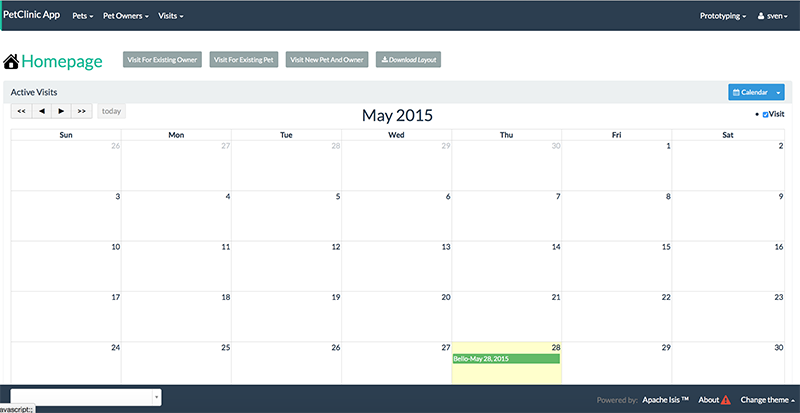
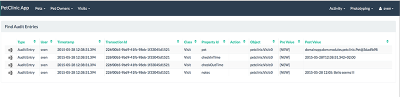
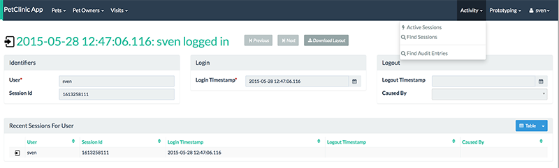
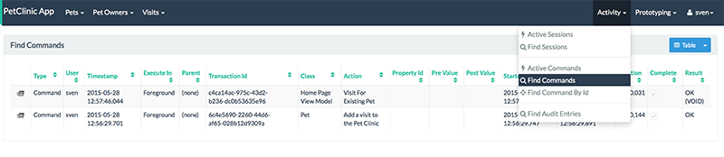
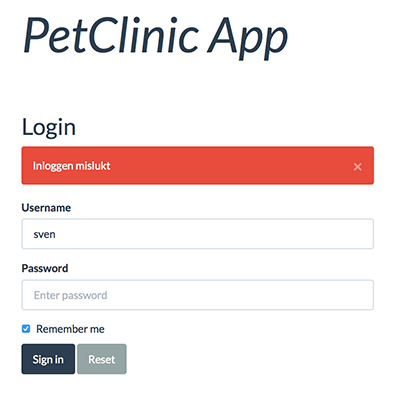
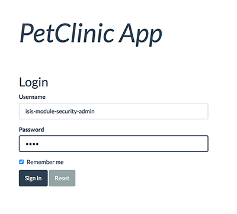
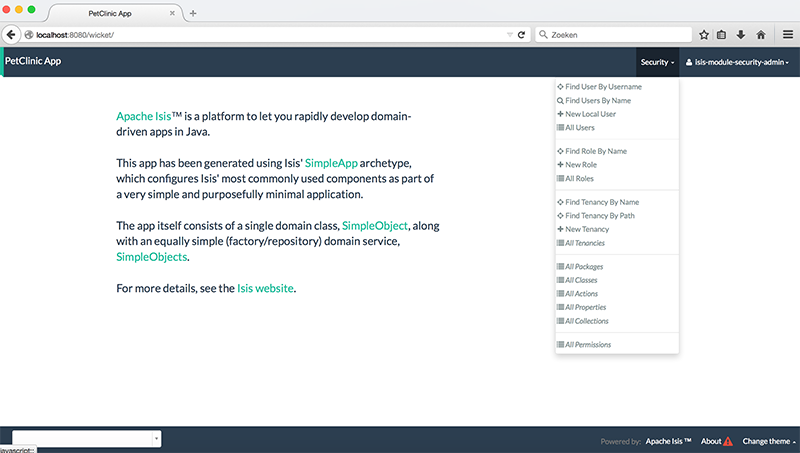

= Step 13: using Apache Isis Add-ons

==== *the basics* in 20 minutes

In this final step we are going to use several link:http://www.isisaddons.org/[Add-ons for Apache Isis].
Add-ons are not part of ASF, but are maintained by the Apache Isis Committers.

'''
*Checkout the code with the results of this exercise on:*

* link:https://github.com/johandoornenbal/petclinic_mynewcode/tree/tutorial10[]

'''
Detailed installation instructions and examples can be found in the github repo of each add-on.
Let's install them all at once here - though we wait with adapting `shiro.ini` to use the security module until later.

We add the following properties to our project's `pom.xml`
----
        <isis-module-devutils.version>1.9.0-SNAPSHOT</isis-module-devutils.version>
        <isis-module-audit.version>1.9.0-SNAPSHOT</isis-module-audit.version>
        <isis-module-command.version>1.9.0-SNAPSHOT</isis-module-command.version>
        <isis-module-publishing.version>1.9.0-SNAPSHOT</isis-module-publishing.version>
        <isis-module-security.version>1.9.0-SNAPSHOT</isis-module-security.version>
        <isis-module-sessionlogger.version>1.9.0-SNAPSHOT</isis-module-sessionlogger.version>
        <isis-wicket-fullcalendar2.version>1.9.0-SNAPSHOT</isis-wicket-fullcalendar2.version>
----

We add the following dependencies to our project's `pom.xml`
----
           <dependency>
                <groupId>org.isisaddons.module.audit</groupId>
                <artifactId>isis-module-audit-dom</artifactId>
                <version>${isis-module-audit.version}</version>
            </dependency>
            <dependency>
                <groupId>org.isisaddons.module.command</groupId>
                <artifactId>isis-module-command-dom</artifactId>
                <version>${isis-module-command.version}</version>
            </dependency>
            <dependency>
                <groupId>org.isisaddons.module.devutils</groupId>
                <artifactId>isis-module-devutils-dom</artifactId>
                <version>${isis-module-devutils.version}</version>
            </dependency>
            <dependency>
                <groupId>org.isisaddons.module.security</groupId>
                <artifactId>isis-module-security-dom</artifactId>
                <version>${isis-module-security.version}</version>
            </dependency>
            <dependency>
                <groupId>org.isisaddons.module.sessionlogger</groupId>
                <artifactId>isis-module-sessionlogger-dom</artifactId>
                <version>${isis-module-sessionlogger.version}</version>
            </dependency>
            <dependency>
                <groupId>org.isisaddons.wicket.fullcalendar2</groupId>
                <artifactId>isis-wicket-fullcalendar2-cpt</artifactId>
                <version>${isis-wicket-fullcalendar2.version}</version>
            </dependency>
----

To `dom/pom.xml` we add the following dependencies:

----
        <dependency>
            <groupId>org.isisaddons.module.audit</groupId>
            <artifactId>isis-module-audit-dom</artifactId>
        </dependency>
        <dependency>
            <groupId>org.isisaddons.module.command</groupId>
            <artifactId>isis-module-command-dom</artifactId>
        </dependency>
        <dependency>
            <groupId>org.isisaddons.module.devutils</groupId>
            <artifactId>isis-module-devutils-dom</artifactId>
        </dependency>
        <dependency>
            <groupId>org.isisaddons.module.security</groupId>
            <artifactId>isis-module-security-dom</artifactId>
            <version>1.9.0-SNAPSHOT</version>
        </dependency>
        <dependency>
            <groupId>org.mindrot</groupId>
            <artifactId>jbcrypt</artifactId>
            <version>0.3m</version>
        </dependency>
        <dependency>
            <groupId>org.isisaddons.module.sessionlogger</groupId>
            <artifactId>isis-module-sessionlogger-dom</artifactId>
        </dependency>
        <dependency>
            <groupId>org.isisaddons.wicket.fullcalendar2</groupId>
            <artifactId>isis-wicket-fullcalendar2-cpt</artifactId>
        </dependency>
----

And we modify our `web/pom.xml` in order to add isis-module-devutils:
----
        <dependency>
            <groupId>org.isisaddons.module.devutils</groupId>
            <artifactId>isis-module-devutils-dom</artifactId>
        </dependency>
----

Now we modify `isis.properties` to (automatically) register several services
----
isis.services.ServicesInstallerFromAnnotation.packagePrefix= \
                domainapp, \
                org.apache.isis, \
                org.isisaddons
----

==== isis-module-devutils

When you build and restart the app at this stage, notice the following developer utils in your UI:

* the 'Download Layout' action on homepage and the objects. This is to provide you with a `Xxx.layout.json` that you can use for tweaking the UI.
* the 3 additional items in the `Prototyping` menu. (Regarding the metamodel and download of all layout files at once.)

==== isis-wicket-fullcalendar2

We would like to display `Visit` 's in a calenderview. Therefore we modify `Visit` like this.

* We add the `CalendarEventable` interface

----
public class Visit implements Comparable<Visit>, CalendarEventable {

    ....

}
----
* We add the following code (don't forget to inject the `DomainObjectContainer`)
----
//region > calender (module)
    @Programmatic
    @Override
    public String getCalendarName() {
        return "Visit";
    }

    @Programmatic
    @Override
    public CalendarEvent toCalendarEvent() {
        return new CalendarEvent(getCheckInTime(), "", container.titleOf(this));
    }
    //endregion

    ....

    @Inject
    private DomainObjectContainer container;
----

On collections of `Visit` you can now choose the Calender View

==== isis-module-audit

Let's annotate `Visit` with
----
@DomainObject(auditing = Auditing.ENABLED)
----

When the audit add-on is activated a menu item 'Activity' is added to the UI. Use 'Find Audit Entries' to see what happened in `Visit`.

==== isis-module-sessionlogger

Activating the sessionlogger adds the following to the menu item 'Activity':

* Active Sessions
* Find Sessions

==== isis-module-command

Activating the sessionlogger adds the following to the menu item 'Activity':

* Active Commands
* Find Commands
* Find Command by Id

==== isis-module-security

When activating the security module we adapt `isis.properties`
----
isis.services = \
                # customizable exception handling, \
                org.apache.isis.objectstore.jdo.applib.service.exceprecog.ExceptionRecognizerCompositeForJdoObjectStore, \
                # Security module, \
                org.isisaddons.module.security.dom.password.PasswordEncryptionServiceUsingJBcrypt,\
                org.isisaddons.module.security.dom.permission.PermissionsEvaluationServiceAllowBeatsVeto
----

and

`shiro.ini` we tell Shiro to use the security module

----
# to use .ini file
#securityManager.realms = $iniRealm

# Use isis-module-security
isisModuleSecurityRealm=org.isisaddons.module.security.shiro.IsisModuleSecurityRealm
authenticationStrategy=org.isisaddons.module.security.shiro.AuthenticationStrategyForIsisModuleSecurityRealm
securityManager.authenticator.authenticationStrategy = $authenticationStrategy

securityManager.realms = $isisModuleSecurityRealm
----

When building and restarting you notice that 'sven' is no longer admitted.
(A clear sign that we use a new authorization system.) Instead we have to login as 'isis-module-security-admin' with
default password 'pass' in order to setup the security.

As an exercise study the documentation on link:https://github.com/isisaddons/isis-module-security[isis-module-security] and
try setting up 'sven' again as a local user with the appropriate rights. Just remember that - when you use an in-memory database like
we did in this tutorial - you loose your configuration between runs.

'''
link:13_petclinic_createhomepage.adoc[<< BACK]