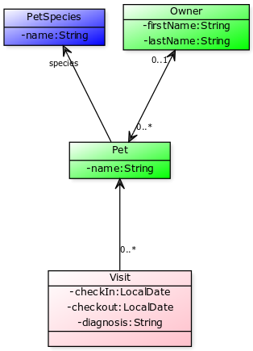

= APACHE ISIS STEP-BY-STEP TUTORIAL: PETCLINIC

== Introduction

Apache Isis is a framework that enables you to create domain driven applications in a very short amount of time.
As a developer you concentrate on creating your domain model and behaviour and capture it in code. Apache Isis delivers a User Interface, a REST api
and persistence with a minimum of effort from your side.

As you work through this step-by-step tutorial we think you will discover the magic of truly Rapid Application Design and fast prototyping.
Valuable assets in this age of Agile approach of projects.

== Scope

Our app will support the following use cases::
* register a Pet and a Owner
* maintain a Pet's details
* check in a Pet to visit the clinic
* enter a diagnosis
* check out a Pet to visit the clinic

Every step will highlight new features of the Apache Isis approach in order for you to become
familiar with some core concepts and features.
All this in just over 2 hours of your time once you have set up your development environment.
You can follow along step by step and / or check out the tags from the
corresponding link:https://github.com/johandoornenbal/petclinic[github repo].

The Petclinic application consists of three domain classes:

The diagram was build using link:http://yuml.me/[yuml.me] and the following DSL:
----
[Pet|-name:String{bg:green}]<-0..*[Visit|-checkIn:LocalDate;-checkout:LocalDate;-diagnosis:String|{bg:pink}]
[Owner|-firstName:String;-lastName:String{bg:green}]<0..1-0..*>[Pet]
[PetSpecies|-name:String{bg:blue}]<species-[Pet]
----

== Prerequisites

You will need::
* JDK 8
* link:http://maven.apache.org[Maven 3.2.x]
* an IDE, such as link:http://www.eclips.org[Eclipse] or link:https://www.jetbrains.com/idea/[IntelliJ IDEA]

'''
link:2_petclinic_build_archetype.adoc[NEXT >>]

