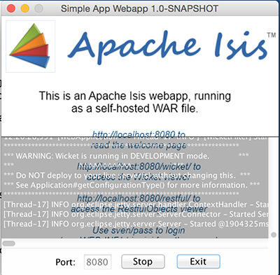

= Step 1: build the simpleapp archetype

==== *the basics* in 10 minutes

Start out by making a new directory for your tutorial code and move into it.
For instance by
----
mkdir isistutorial
cd isistutorial
----
Make sure you have maven installed and check your version - it should be 3.2.x - by
----
mvn -version
----
should output something like
----
Apache Maven 3.2.5 (12a6b3acb947671f09b81f49094c53f426d8cea1; 2014-12-14T18:29:23+01:00)
Maven home: /usr/local/opt/maven
Java version: 1.8.0_45, vendor: Oracle Corporation
Java home: /Library/Java/JavaVirtualMachines/jdk1.8.0_45.jdk/Contents/Home/jre
Default locale: en_US, platform encoding: UTF-8
OS name: "mac os x", version: "10.10.3", arch: "x86_64", family: "mac"
----

Consult the link:http://isis.apache.org/intro/getting-started/simpleapp-archetype.html[Isis website] for
information on building an simple empty Isis application to start with.
We used the snapshot release at the time of writing
----
mvn archetype:generate  \
    -D archetypeGroupId=org.apache.isis.archetype \
    -D archetypeArtifactId=simpleapp-archetype \
    -D archetypeVersion=1.9.0-SNAPSHOT \
    -D groupId=com.mycompany \
    -D artifactId=petclinic \
    -D version=1.0-SNAPSHOT \
    -D archetypeRepository=http://repository-estatio.forge.cloudbees.com/snapshot/ \
    -B
----
To use the stable release at the time of writing:

change
----
-D archetypeVersion=1.9.0-SNAPSHOT
----
to
----
-D archetypeVersion=1.8.0
----

This will generate the app in a `petclinic` directory. You can move the contents back by
----
mv petclinic/* .
rmdir petclinic
----
Now we can build and run the app
----
mvn clean install
mvn antrun:run -P self-host
----
A splash screen should appear offering to start up the app.
Go ahead and start; the web browser should be opened at http://localhost:8080

Alternatively, you can run using the mvn-jetty-plugin:
----
cd webapp
mvn jetty:run
----
This will accomplish the same thing, though the webapp is mounted at a slightly different URL: http://localhost:8080/petclinic-webapp/

'''
link:1_petclinic_introduction.adoc[<< BACK] | link:3_petclinic_usingtheapp.adoc[NEXT>>]