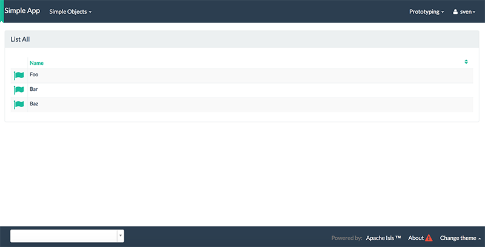

= Step 2: start using the app

==== *the basics* in 10 minutes

In your browser checkout http://localhost:8080. Apache Isis delivers you two interfaces: The Wicket UI and the REST api as you can see.
Let's start with the human experience at http://localhost:8080/wicket

Use sven/pass to login

You can load example test data (`fixtures`) using the `Prototyping` menu-item `Recreate Objects And Return First`

List all the objects created using the `SimpleObjects` menu

'''
==== *spend some extra time* to look around

Play around a bit if you want to explore more. Try making and finding some objects. You can even choose a theme ...
The database used runs in-memory (using HSQLDB) so your created data will be lost between runs.

.themes

.themes

.themes

.themes

'''
==== *spend some extra time* to explore the REST api

Take a look at the REST api following http://localhost:8080/restful/ (you should authorize again with sven/pass)
More on the REST api you will find in link:http://isis.apache.org/[Apache Isis documentation]

When you are familiar with REST you may recognize the structure of the JSON returned. Apache Isis generates a complete api based on the
link:http://restfulobjects.org/[Restful Objects Specification]. Out of the box you have access to practically all functionality delivered
by the UI. Exploring the REST api using a tool like link:https://chrome.google.com/webstore/search/postman[Postman] is easy.

Try listing all the objects created for instance following http://localhost:8080/restful/services/SimpleObjects/actions/listAll/invoke

'''
link:2_petclinic_build_archetype.adoc[<< BACK] | link:4_petclinic_devenvironment.adoc[NEXT >>]