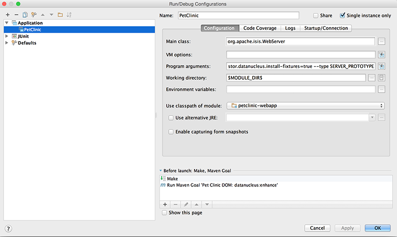
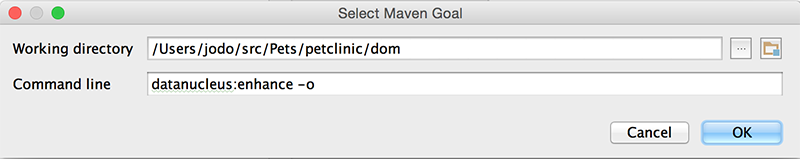

= Step 3: set up your development environment

==== *the basics*

Set up an IDE and import the project to be able to run and debug the app

To configure the app, use these links:

- link:http://isis.apache.org/intro/getting-started/ide/intellij.html[Setup IntelliJ] when using IntelliJ IDEA
- link:http://isis.apache.org/intro/getting-started/ide/eclipse.html[Setup Eclipse] when using Eclipse
- link:http://isis.apache.org/intro/resources/editor-templates.html[Setup editor templates] for both IDE's

Then set up a launch configuration so that you can run the app from within the IDE.
To save having to run the fixtures every time, add the following program argument:

----
-D isis.persistor.datanucleus.install-fixtures=true
----

so the whole line looks like

----
--port 8080  -D isis.persistor.datanucleus.install-fixtures=true --type SERVER_PROTOTYPE
----

Here is an example config for IntelliJ

where the "before launch" maven goal (to run the DataNucleus enhancer) is defined as:

For Eclipse users: you can run the script in `webapp-ide-eclipse-launch-SimpleApp-PROTOTYPE-with-fixtures.launch` after having enhanced
the dom-module for datanucleus.

'''
link:3_petclinic_usingtheapp.adoc[<< BACK] | link:5_petclinic_explorecodebase.adoc[NEXT >>]