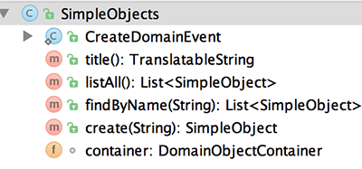
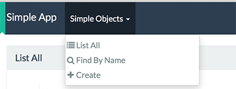
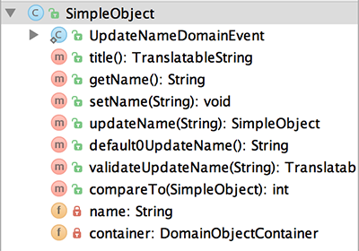
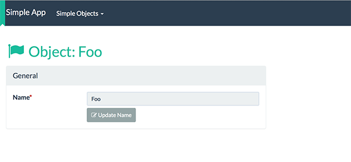
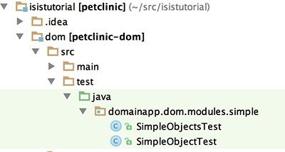
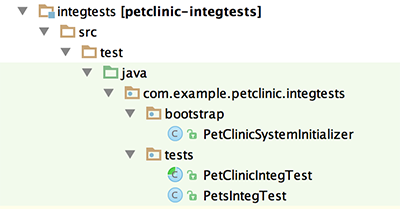
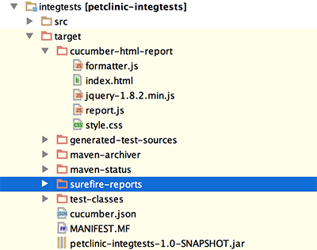

= Step 4: explore the codebase and testing

==== *the basics* in 10 minutes

Apache Isis applications are organized into several Maven modules.
Within your IDE navigate to the various classes and try to correlate back to the generated UI:

* `petclinic` : parentmodule
* `petclinic-dom`: domain objects module
** entity: `domainapp.dom.modules.simple.SimpleObject`
** repository: `domainapp.dom.modules.simple.SimpleObjects`
* `petclinic-fixture`: fixtures module
* `petclinic-integtests`: integration tests module
* `petclinic-webapp`: webapp module
** builds the WAR file

You may notice for instance that the menu-items under SIMPLE OBJECTS in the UI correspond to the methods found in
`domainapp.dom.modules.simple.SimpleObjects`

This is a pattern you will see throughout Apache Isis originating from the link:http://en.wikipedia.org/wiki/Naked_objects[Naked Objects Pattern]: An object has a combined repository and factory class (a service - a singleton) residing in memory
that can be called anytime during runtime.

And you may recognize the property and method on `domainapp.dom.modules.simple.SimpleObject`

=== testing

Testing is of course massively important, and Isis makes both unit testing and (end-to-end) integration testing easy.
Building the app from the Maven command line ("mvn clean install") will run all tests, but you should also run the tests from within the IDE.

Unit tests for objects and their repos reside in `petclinic-dom`

Try to run them.

Integration tests reside as mentioned in `petclinic-integtests`

Try running them - don't forget to enhance `petclinic-dom` for datanucleus first!

Notice how the system is initialized and fixtures are being installed before an integration test is started.
Inspect results in `petclinic-integtests` under `target`.

'''
link:4_petclinic_devenvironment.adoc[<< BACK] | link:6_petclinic_makingyourown.adoc[NEXT >>]
