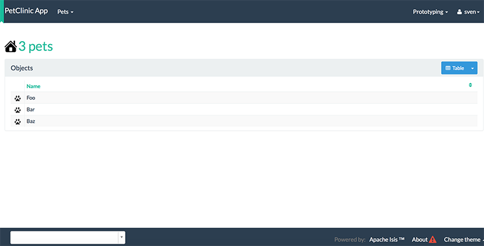

= Step 5: Refactoring the app - making it your own

==== *the basics* in 20 minutes

Time to start refactoring the app. The heart of the PetClinic app is the `Pet` concept, so go through the code and refactor.
While we're at it, refactor the app itself from "SimpleApp" to "PetClinicApp".

The POM files generated by the simpleapp archetype describe the app as "SimpleApp".
We will update them to say "PetClinic" instead.

During this tutorial we're going to keep the integration tests in-sync with the code, but we're going to stop short of writing BDD/Cucumber specs.
Therefore delete the BDD feature spec and glue in the `integtest` module:

`integration/specs/*`

`integration/specglue/*`

'''
*Checkout the code that reflects these changes on:*

* link:https://github.com/johandoornenbal/petclinic_mynewcode/tree/tutorial01[]

'''

Now we start renaming the app and the SimpleObject entity. This exercise will take us through the code and
make us a little bit more familiar with it.

'''
*Checkout the code with the results of this exercise on:*

* link:https://github.com/johandoornenbal/petclinic_mynewcode/tree/tutorial02[]

'''

In outline (check the git commit for more detail), the renames required are:

* in the dom module's production code
** `SimpleObject` -> `Pet` (entity)
** `SimpleObjects` -> Pets (repository domain service)
** `SimpleObject.layout.json` -> `Pet.layout.json` (layout hints for the Pet entity)
** delete the `SimpleObject.png`, and add a new `Pet.png` in `main\resources\images` (icon shown against all Pet instances).
* in the dom module's unit test code
** `SimpleObjectTest` -> `PetTest` (unit tests for Pet entity)
** `SimpleObjectsTest` -> `PetsTest` (unit tests for Pets domain service)
* in the fixture module: rearrange according to code found on git
* in the integtest module: rearrange according to code found on git
* in the webapp module:
** `SimpleApplication` -> `PetClinicApplication`
** update `isis.properties`
** update `web.xml`
** update `shiro.ini` (security)

****
TIP: The refactor option in your IDE can be a great help
****

Note that `Pet` has both both Isis and JDO annotations:

----
@javax.jdo.annotations.PersistenceCapable(
        identityType=IdentityType.DATASTORE,
        schema = "petclinic",
        table = "Pet"
)
@javax.jdo.annotations.DatastoreIdentity(
        strategy=javax.jdo.annotations.IdGeneratorStrategy.IDENTITY,
         column="id")
@javax.jdo.annotations.Version(
        strategy=VersionStrategy.VERSION_NUMBER,
        column="version")
@javax.jdo.annotations.Queries({
        @javax.jdo.annotations.Query(
                name = "find", language = "JDOQL",
                value = "SELECT "
                        + "FROM domainapp.dom.modules.simple.Pet "),
        @javax.jdo.annotations.Query(
                name = "findByName", language = "JDOQL",
                value = "SELECT "
                        + "FROM domainapp.dom.modules.simple.Pet "
                        + "WHERE name.indexOf(:name) >= 0 ")
})
@javax.jdo.annotations.Unique(name="Pet_name_UNQ", members = {"name"})
@DomainObject
@DomainObjectLayout(
        bookmarking = BookmarkPolicy.AS_ROOT
)
public class Pet implements Comparable<Pet> {
....
}
----

where:

* `PersistenceCapable` and `DatastoreIdentity` specify a surrogate Id column to be used as the primary key
* `Version` provides support for optimistic locking
* `Unique` enforces a uniqueness constraint so that no two `Pet`s can have the same name (unrealistic, but can refactor later)
* `Bookmarking = BookmarkPolicy.AS_ROOT` in `@DomainObjectLayout` indicates that the object can be automatically bookmarked in Isis' Wicket viewer and is a top-level 'root' (or parent) bookmark.

The Pets domain service also has Isis annotations:

----
@DomainService(repositoryFor = Pet.class)
@DomainServiceLayout(menuOrder = "10")
public class Pets {
    ...
}
----

where:

* `DomainService` indicates that the service should be instantiated automatically (as a singleton)
* `DomainServiceLayout` provides UI hints, in this case the positioning of the menu for the actions provided by the service

'''

The last thing to refactor are the packages names

The classes created by the simpleapp archetype are by default in the `modules.simple` package. Move these classes to `modules.petclinic` package instead.
Also adjust package names where they appear as strings:

* in `WEB-INF/web.xml`, change the app name to "PetClinic App"
* in `domainapp.webapp.PetClinicApplication`, change occurrences of 'Simple App' to 'PetClinic App' in names and messages.

=== The result

'''
link:5_petclinic_explorecodebase.adoc[<< BACK] | link:7_petclinic_petspecies.adoc[NEXT >>]