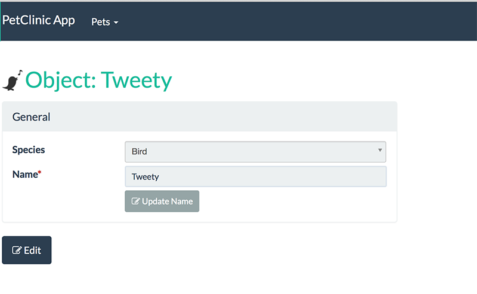

= Step 6: Adding PetSpecies

==== *the basics* in 10 minutes

'''
*Checkout the code with the results of this exercise on:*

* link:https://github.com/johandoornenbal/petclinic_mynewcode/tree/tutorial03[]

'''

Each `Pet` is of a particular species. We can model these as an enum called `PetSpecies`:

----
public enum PetSpecies {
    DOG,
    CAT,
    TURTLE,
    BIRD
}
----

Now introduce a new property on `Pet` of this type:

----
private PetSpecies species;

@MemberOrder(sequence = "2")
@Column(allowsNull = "false")
public PetSpecies getSpecies() {
    return species;
}

public void setSpecies(PetSpecies species) {
    this.species = species;
}
----

Let's take a look at some details:

The annotation `@MemberOrder(sequence = "2")` hints to the UI the order in which the properties will be displayed.
We added `@MemberOrder(sequence = "1")` to the `name` property. These annotations will be overruled though by
`Pet.layout.json` where you can specify the layout in more detail.

The annotation `@Column(allowsNull = "false")` (this is `@javax.jdo.annotations.Column(allowsNull = "false")`) tells the JDO
persistence layer that this property cannot be empty.

Note that this is all attention spend here at interface and persistence. Apache Isis takes care of everything else, like rendering
the different `PetSpecies` as items in a dropdown menu as we will see when running the new code. Cool uh?

Introducing this new property however naturally does result in a few other tasks for us to perform

* update the `create()` method in `Pets` - it is a required property remember...
* update our fixtures
* update our unit and integration tests
* update our icons
* evaluate the editing possibilities of created instances

==== Update `create()` method
----
public Pet create(
            final @ParameterLayout(named="Name") String name,
            final @ParameterLayout(named="Species") PetSpecies petSpecies) {
        final Pet obj = container.newTransientInstance(Pet.class);
        obj.setName(name);
        obj.setSpecies(petSpecies);
        container.persistIfNotAlready(obj);
        return obj;
    }
----

We added the line `obj.setSpecies(petSpecies);`

Note that we make use of the Apache Isis framework methods to instantiate and persist a new object instance:

* `container.newTransientInstance(Pet.class)`
* `container.persistIfNotAlready(obj)`

where `DomainObjectContainer container` is made available using injection:

----
    @javax.inject.Inject
    DomainObjectContainer container;
----

Note also the use of another UI annotation: `@ParameterLayout(named="Species")` which may not need an explanation.

==== Update our fixtures and tests

We don't go deeper into fixtures and tests here. You can study the code on link:https://github.com/johandoornenbal/petclinic_mynewcode/tree/tutorial03[]

==== Icon reflects the pet species

Rather than using a single icon for a domain class, instead a different icon can be supplied for each instance.
We can therefore have different icon files for each pet, reflecting that pet's species.

----
public String iconName() {
        return enumToCamelCase(getSpecies());
    }
----

This is all the framework needs: it will search for an image file named `iconName()` in `resources/images`

==== Evaluate the editing possibilities

When we run the application it this point you may notice the edit button that the framework supplies. In the code before this
step we defined an `updateName()` method on `Pet`. Also we annotated `getName()` with `@Property(
                                                                                                 editing = Editing.DISABLED
 )` which disables editing using the general 'Edit' button and forces the user to use `updateName()`.

Now you decide what to do:

* disable editing for `species` and
* write an `updateSpecies()` method in case you want the species property to be edited by the user
* or discard `updateName()` and enable editing for `name`.

As an exercise you may try both.

'''
link:6_petclinic_makingyourown.adoc[<< BACK] | link:8_petclinic_addowner.adoc[NEXT >>]