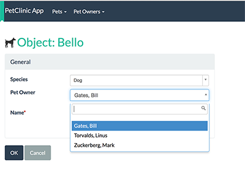

= Step 7: Add Pet Owner

==== *the basics* in 10 minutes

'''
*Checkout the code with the results of this exercise on:*

* link:https://github.com/johandoornenbal/petclinic_mynewcode/tree/tutorial04[]

'''
The tasks we will perform are:

* Add the `PetOwner` entity and corresponding `PetOwners` domain service (repository).
* Add a query to find `PetOwner` s by name.

First try setting up `PetOwner` with the properties `firstName` and `lastName yourself`.

Then set up `PetOwners` domain service with method `addOwner()`.

Compare your code to ours. You may have wondered already how to define the relationship between an
`PetOwner` and it's `Pet` s. Here's is how we implement this 2-way relationship:

on `Pet` we define `petOwner` of type `PetOwner` since a `Pet` can have 0 or 1 `PetOwner` - note how `petOwner` is annotated
with `@Column(allowsNull = "true")`:

----
private PetOwner petOwner;

    @MemberOrder(sequence = "3")
    @Column(name = "ownerId", allowsNull = "true")
    public PetOwner getPetOwner() {
        return petOwner;
    }

    public void setPetOwner(final PetOwner petOwner) {
        this.petOwner = petOwner;
    }
----

on `PetOwner` we define a collection `pets` since an `PetOwner` can own 0 or more `Pet` s:

----
@Persistent(mappedBy = "petOwner", dependentElement = "false")
    private SortedSet<Pet> pets = new TreeSet<Pet>();

    @MemberOrder(sequence = "3")
    @CollectionLayout(render = RenderType.EAGERLY)
    public SortedSet<Pet> getPets() {
        return pets;
    }

    public void setPets(final SortedSet<Pet> pets) {
        this.pets = pets;
    }
----

Note the annotation `@Persistent(mappedBy = "petOwner", dependentElement = "false")` property `petOwner` on `Pet` is indicated to define the relationship.

We will set up a query to find `PetOwner` s by name using `Predicates` as follows:

in `PetOwner`
----
public static class Predicates {

    public static Predicate<PetOwner> contains(final String string) {
       return new Predicate<PetOwner>() {
           @Override
           public boolean apply(final PetOwner petOwner) {
               return petOwner.getFirstName().toLowerCase().contains(string.toLowerCase()) ||
                       petOwner.getLastName().toLowerCase().contains(string.toLowerCase());
           }
       };
   }
}
----

in `PetOwners`
----
public List<PetOwner> findByName(String name) {
   return container.allMatches(PetOwner.class, PetOwner.Predicates.contains(name));
}
----

Note how this method is an alternative for using a query like we used for `findByName()` method in `Pets`.

Also notice the following annotation in `Pet`:

`@DomainObject(autoCompleteAction = "findByName", autoCompleteRepository = PetOwners.class)`.
This is how we tell the UI which action to use in the `PetOwners.class` to look up a `PetOwner`. In this case `findByName()`.

Now we have some more tasks to perform to update our code:

* update our `create()` method in `Pets`
* update our fixtures
* update our tests

==== update create() for `Pet`

Notice how we use annotations here to make `petOwner` optional instead of the default mandatory

----
public Pet create(
        final @ParameterLayout(named="Name") String name,
        final @ParameterLayout(named="Species") PetSpecies petSpecies,
        final @ParameterLayout(named="Pet Owner") @Parameter(optionality = Optionality.OPTIONAL) PetOwner petOwner) {
    final Pet obj = container.newTransientInstance(Pet.class);
    obj.setName(name);
    obj.setSpecies(petSpecies);
    obj.setPetOwner(petOwner);
    container.persistIfNotAlready(obj);
    return obj;
}
----

==== update our fixtures

We add `deleteFrom(PetOwner.class)` before `deleteFrom(Pet.class)`
----
 deleteFrom(Pet.class);
 deleteFrom(PetOwner.class);
----

Try reversing the order and see if you can understand the following:

----
Caused by: org.apache.isis.core.runtime.persistence.ObjectPersistenceException: Failed to executeSql: delete from petclinic."PetOwner"
	at org.apache.isis.objectstore.jdo.datanucleus.service.support.IsisJdoSupportImpl.executeUpdate(IsisJdoSupportImpl.java:146)
	...

Caused by: java.sql.SQLIntegrityConstraintViolationException: integrity constraint violation: foreign key no action; Pet_FK1 table: Pet
	at org.hsqldb.jdbc.JDBCUtil.sqlException(Unknown Source)
----

Got it? Since there is a dependency - `Pet` stores a `petOwner` - we first have to delete all pets and then delete the petOwners.

'''
link:7_petclinic_petspecies.adoc[<< BACK] | link:9_petclinic_.adoc[NEXT >>]