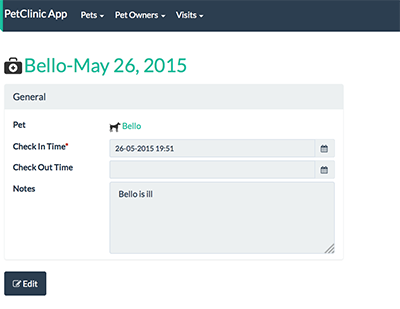
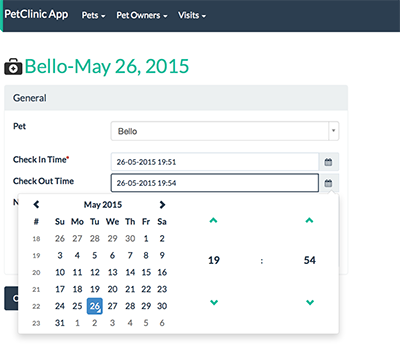

= Step 8: Add Visit

==== *the basics* in 10 minutes

'''
*Checkout the code with the results of this exercise on:*

* link:https://github.com/johandoornenbal/petclinic_mynewcode/tree/tutorial05[]

'''

Now we will add the entity `Visit`.
Start setting it up yourself the way we did with `PetOwner` using the UML in link:1_petclinic_introduction.adoc[] and
compare your code with ours.

Take note of how the framework deals with `LocalDate` in the UI

Also try setting up autocompletion for `Pet` as you may have figured this is the linking property to `Visit`.
Use the `findByName` action. Compare your code with ours.

Don't forget to adapt your fixturescript:

Put `deleteFrom(Visit.class)` before pets.

Were this code meant for production, you may have written Unit and integration tests ....

'''
link:8_petclinic_addowner.adoc[<< BACK] | link:10_petclinic_.adoc[NEXT >>]